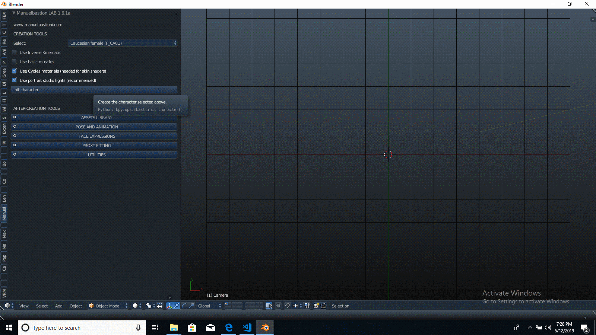

<!DOCTYPE HTML PUBLIC "-//W3C//DTD HTML 4.0 Transitional//EN">

<HTML>

<HEAD>

	
	

</HEAD>

<BODY DIR="LTR">

<B>Pino_kio_PoseTool</B>

***WARNING:

Only tested on 2.79, but should work for 2.80***

How to use this script:

1) Must have MB Lab downloaded. <A HREF="https://github.com/animate1978/MB-Lab"><U>https://github.com/animate1978/MB-Lab</U></A>

2) Init character.

 
3) Finalize character.

4) Load pino_kio.py into text editor and run script.

5) The script loads 3 sphere empties,&quot; headTarget&quot;, leftTarget&quot; and &quot;rightTarget&quot;, that are targets for  

   object mode posing.

6) Move targets to change pose. Updates in realtime  in 3D View window.

Example of use in screenshots below.

  

  

  

  

</BODY>

</HTML> 

 

 

 

 
